# F1 Predictions


A full-stack machine learning platform that predicts Formula 1 race outcomes and presents them through an interactive dashboard. Covers race winners, qualifying positions, championship probabilities, lap times, and pit strategy — all trained on real historical data from the FastF1 and Ergast APIs.

---

## Overview

F1 Predictions combines historical race data (2018–2026) with gradient-boosted models and Monte Carlo simulation to produce probabilistic forecasts for every aspect of an F1 weekend. The backend ingests data from two primary sources — [FastF1](https://docs.fastf1.dev/) for telemetry, lap times, and tire compounds, and the [Ergast/Jolpica API](https://ergast.com/mrd/) for results, standings, and schedules — then pushes it through a feature engineering pipeline that computes rolling driver form, team performance, and circuit-specific statistics.

Trained models are served via a FastAPI REST API that the Next.js 15 frontend consumes. The dashboard includes race predictions with probability bars, an interactive Monte Carlo championship simulator, full race results with podium highlights, driver profile cards, WDC/WCC standings tables, and model performance metrics. A 3D track viewer and telemetry panels are available for deeper analysis.

The entire data layer uses Parquet files (no database required), making the project easy to run locally without any infrastructure setup.

---

## Architecture

```mermaid
flowchart LR
    subgraph dataSources [Data Sources]
        FastF1[FastF1 API]
        Ergast[Ergast / Jolpica API]
    end

    subgraph backend [Python Backend]
        Collect[Data Collection]
        Features[Feature Engineering]
        subgraph models [ML Models]
            XGB1[Race Winner - XGBoost]
            LGBM[Qualifying - LightGBM]
            MC[Championship - Monte Carlo]
            XGB2[Lap Times - XGBoost]
            Strat[Strategy - Heuristic]
        end
        API[FastAPI Server]
    end

    subgraph frontend [Next.js Frontend]
        Dashboard[Dashboard]
        Races[Race Results]
        Drivers[Driver Cards]
        Standings[Standings]
        Championship[Championship Sim]
        ModelPerf[Model Performance]
    end

    FastF1 --> Collect
    Ergast --> Collect
    Collect -->|Parquet files| Features
    Features --> models
    models -->|joblib artifacts| API
    API -->|REST JSON| frontend
    Ergast -->|Live data| frontend
```



---

## Tech Stack

### Backend

| Library | Version | Purpose |
|---------|---------|---------|
| Python | 3.11+ | Runtime |
| FastAPI | 0.115+ | REST API framework |
| Uvicorn | 0.30+ | ASGI server |
| pandas | 2.2+ | Data manipulation |
| NumPy | 1.26+ | Numerical computing |
| SciPy | 1.14+ | Statistical functions |
| scikit-learn | 1.5+ | Preprocessing, model evaluation, cross-validation |
| XGBoost | 2.1+ | Gradient boosting (race winner, lap times) |
| LightGBM | 4.5+ | Gradient boosting (qualifying) |
| FastF1 | 3.4+ | Official F1 telemetry & lap data |
| PyArrow | 17.0+ | Parquet I/O |
| Pydantic | 2.9+ | Request/response validation |
| joblib | 1.4+ | Model serialization |
| structlog | 24.4+ | Structured logging |
| httpx | 0.27+ | HTTP client (API calls) |

### Frontend

| Library | Version | Purpose |
|---------|---------|---------|
| Next.js | 15 | React framework (App Router) |
| React | 19 | UI library |
| Tailwind CSS | 4 | Utility-first styling |
| D3.js | 7.9 | Custom data visualizations |
| Recharts | 2.15 | Chart components |
| Three.js | 0.170 | 3D track rendering |
| @react-three/fiber | 9 | React renderer for Three.js |
| @react-three/drei | 10 | Three.js helpers |
| Framer Motion | 11 | Animations & transitions |
| Zustand | 5 | Client state management |
| Lucide React | 0.460 | Icon set |
| TypeScript | 5.6+ | Type safety |

---

## Project Structure

```
f1/
├── src/                          # Python backend
│   ├── data/
│   │   ├── collect.py            # Fetches 2018–2026 data from FastF1 & Ergast
│   │   └── generate_synthetic.py # Generates synthetic data for offline/testing
│   ├── features/
│   │   └── engineering.py        # Rolling form, team stats, circuit features, quali gaps
│   ├── models/
│   │   ├── race_winner.py        # XGBoost win/podium classifier
│   │   ├── qualifying.py         # LightGBM grid position regressor
│   │   ├── championship.py       # Monte Carlo season simulator (10k runs)
│   │   ├── lap_times.py          # XGBoost lap time regressor
│   │   └── strategy.py           # Pit stop heuristic engine
│   ├── predict/
│   │   └── predictor.py          # Unified prediction facade (loads & routes to models)
│   └── api/
│       └── app.py                # FastAPI server with CORS, startup model loading
│
├── frontend/                     # Next.js dashboard
│   └── src/
│       ├── app/
│       │   ├── page.tsx           # Landing page
│       │   ├── layout.tsx         # Root layout
│       │   └── (app)/            # App shell (sidebar nav)
│       │       ├── dashboard/     # Main predictions dashboard
│       │       ├── races/         # Race results with podium highlights
│       │       ├── drivers/       # Driver cards with team colors
│       │       ├── standings/     # WDC & WCC standings tables
│       │       ├── championship/  # Interactive Monte Carlo sim
│       │       └── models/        # Model accuracy & metrics
│       ├── components/
│       │   ├── layout/            # Navbar
│       │   ├── ui/                # Card, Badge, StatCard, DataTable, Sidebar, RaceTimeline
│       │   ├── simulation/        # SimulationPanel (what-if scenarios)
│       │   ├── telemetry/         # TelemetryPanel (speed, throttle, brake, DRS)
│       │   └── track/             # TrackViewer (3D circuit rendering)
│       ├── lib/
│       │   ├── f1-api.ts          # Ergast/Jolpica API client
│       │   └── predictions-api.ts # Backend prediction API client
│       └── types/
│           └── index.ts           # TypeScript interfaces
│
├── data/                         # (gitignored) generated at runtime
│   ├── raw/                      # Race results, qualifying, standings (parquet)
│   ├── processed/                # Feature matrix (parquet)
│   ├── models/                   # Trained model artifacts (joblib)
│   └── fastf1_cache/             # FastF1 telemetry cache
│
├── notebooks/                    # Jupyter notebooks for exploration
├── tests/                        # pytest test suite
├── requirements.txt              # Python dependencies
└── pyproject.toml                # Project config, ruff, pytest settings
```

---

## Models

### Race Winner (XGBoost Classifier)

Predicts the probability of each driver winning or finishing on the podium. Two separate XGBoost classifiers are trained — one for outright wins and one for top-3 finishes. Uses `TimeSeriesSplit` cross-validation to respect the temporal ordering of races.

**Features used:** grid position, rolling 5-race averages (finish position, points, podium rate, points finishes, DNFs), career race count, career points, qualifying gap percentage, head-to-head rolling record, circuit-level stats (average grid of winner, pole-to-win rate, average finishers).

**Metrics:** accuracy, log loss, top-k accuracy.

### Qualifying (LightGBM Regressor)

Predicts expected qualifying grid position for each driver at a given circuit. LightGBM is used for its speed and performance on tabular regression.

### Championship (Monte Carlo Simulation)

Simulates the remainder of the season 10,000 times using each driver's win probability distribution. For each simulation, race results are sampled from the probability distribution and the standard F1 points system (25-18-15-12-10-8-6-4-2-1) is applied. Outputs the probability of each driver winning the championship, finishing in the top 3, and the expected final points distribution.

### Lap Times (XGBoost Regressor)

Predicts expected lap times based on driver form, circuit characteristics, and historical performance. Useful for strategy simulations and race pace comparisons.

### Strategy (Heuristic Engine)

Predicts optimal pit stop windows and tire compound selections based on historical patterns at each circuit. Combines degradation curves, stint lengths, and track position data rather than a trained ML model.

---

## Getting Started

### Prerequisites

- **Python 3.11+** — [python.org/downloads](https://www.python.org/downloads/)
- **Node.js 18+** — [nodejs.org](https://nodejs.org/)
- ~2 GB disk space for cached telemetry data (if using FastF1)

### 1. Clone & install Python dependencies

```bash
git clone <repo-url> && cd f1
pip install -r requirements.txt
```

Or install with dev dependencies (pytest, ruff, jupyter, matplotlib):

```bash
pip install -e ".[dev]"
```

### 2. Collect data

Pull historical race data from the Ergast API (2018–2026). This creates Parquet files in `data/raw/`.

```bash
python -m src.data.collect
```

If you're offline or just want to test the pipeline quickly, generate synthetic data instead:

```bash
python -m src.data.generate_synthetic
```

### 3. Build feature matrix

Runs the feature engineering pipeline — computes rolling driver form, team performance metrics, qualifying gaps, and circuit-level statistics. Outputs `data/processed/features.parquet`.

```bash
python -m src.features.engineering
```

### 4. Train models

Train each model individually. Trained artifacts are saved as joblib files in `data/models/`.

```bash
python -m src.models.race_winner
python -m src.models.qualifying
```

### 5. Start the prediction API

```bash
uvicorn src.api.app:app --reload --port 8000
```

The API will attempt to load trained models on startup. If models aren't trained yet, it starts anyway but prediction endpoints will fail. API docs are available at [http://localhost:8000/docs](http://localhost:8000/docs) (auto-generated Swagger UI).

### 6. Start the frontend

```bash
cd frontend
npm install
npm run dev
```

The dashboard opens at [http://localhost:3000](http://localhost:3000). It fetches live F1 data from the Ergast API directly and prediction data from the backend API.

---

## Environment Variables

| Variable | Service | Default | Description |
|----------|---------|---------|-------------|
| `NEXT_PUBLIC_API_URL` | Frontend | `http://127.0.0.1:8000` | URL of the FastAPI prediction backend |

The backend uses sensible defaults and doesn't require any env vars for local development. Both `.env` and `.env.local` files are gitignored.

---

## API Reference

Base URL: `http://localhost:8000`

### `GET /health`

Health check and model loading status.

```json
{ "status": "ok", "models_loaded": true }
```

### `GET /predictions/next-race`

Returns win and podium probabilities for every driver in the most recent race in the feature dataset.

**Response:**

```json
{
  "predictions": [
    { "driver": "max_verstappen", "win_probability": 0.38, "podium_probability": 0.72 },
    { "driver": "lando_norris", "win_probability": 0.22, "podium_probability": 0.61 }
  ]
}
```

**Errors:** `503` if features haven't been generated, `404` if no race data found.

### `POST /predictions/championship`

Runs a Monte Carlo championship simulation.

**Request body:**

```json
{
  "current_standings": { "max_verstappen": 275, "lando_norris": 248 },
  "remaining_races": 8,
  "win_probabilities": { "max_verstappen": 0.35, "lando_norris": 0.25 }
}
```

### `POST /predictions/strategy`

Predicts optimal race strategy for a given circuit.

**Request body:**

```json
{
  "circuit_id": "monza",
  "total_laps": 53,
  "grid_position": 3
}
```

### `GET /models/performance`

Returns accuracy metrics (accuracy, log loss, MAE) for all trained models.

Full interactive API docs are available at `/docs` (Swagger UI) and `/redoc` (ReDoc) when the server is running.

---

## Frontend Pages

| Page | Route | Description |
|------|-------|-------------|
| **Dashboard** | `/dashboard` | Race winner & podium probability bars, predicted qualifying order, upcoming race info |
| **Races** | `/races` | Full race results with podium highlights and classification breakdowns |
| **Drivers** | `/drivers` | Driver profile cards with team colors, season points, and win counts |
| **Standings** | `/standings` | Tabbed WDC (drivers) and WCC (constructors) championship tables |
| **Championship** | `/championship` | Interactive Monte Carlo simulator — adjust remaining races and see probability shifts |
| **Model Performance** | `/models` | Accuracy, log loss, and MAE metrics for each trained model |

Additional components include a **3D track viewer** (Three.js), **telemetry panels** showing speed/throttle/brake/DRS traces, and a **simulation panel** for counterfactual what-if scenarios.

---

## Data Sources

### FastF1

The [FastF1](https://docs.fastf1.dev/) Python library provides access to official F1 timing data including:

- Lap-by-lap times and sector splits
- Car telemetry (speed, throttle, brake, DRS, gear)
- Tire compound and stint information
- Weather data (track temp, air temp, rainfall)

Data is cached locally in `data/fastf1_cache/` to avoid repeated API calls.

### Ergast / Jolpica API

The [Ergast API](https://ergast.com/mrd/) provides structured historical data:

- Race results and classifications (1950–present)
- Qualifying results
- Driver and constructor standings
- Season schedules and circuit information

The frontend also calls this API directly for live standings and race results.

---

## Development

### Linting & formatting

The project uses [Ruff](https://docs.astral.sh/ruff/) for both linting and formatting, configured in `pyproject.toml`:

```bash
ruff check src/          # Lint
ruff format src/         # Format
```

Enabled rule sets: `E` (pycodestyle), `F` (pyflakes), `I` (isort), `N` (pep8-naming), `W` (warnings), `UP` (pyupgrade), `B` (bugbear), `SIM` (simplify).

### Type checking & linting (frontend)

```bash
cd frontend
npm run typecheck        # TypeScript strict check
npm run lint             # ESLint (Next.js config)
```

### Testing

```bash
pytest                   # Run all tests
pytest --cov             # With coverage
```

### Notebooks

Jupyter notebooks in `notebooks/` are available for data exploration and model prototyping:

```bash
pip install -e ".[dev]"  # Includes jupyter, matplotlib, seaborn
jupyter notebook
```
